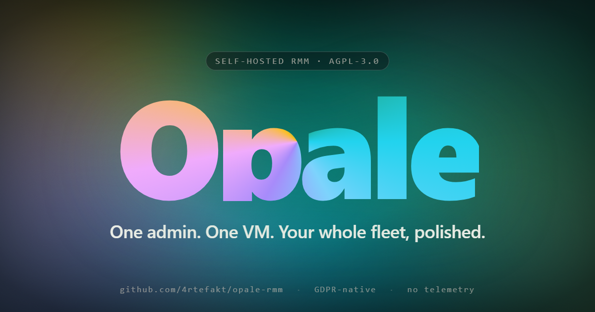

# Opale

[](https://github.com/4rtefakt/opale/actions/workflows/ci.yml)
[](https://github.com/4rtefakt/opale/releases)
[](LICENSE)
[](https://github.com/4rtefakt/opale/pkgs/container/opale)

> **A self-hosted Remote Monitoring & Management platform for small organisations.**
> Inventory, alerts, ticketing, scripts, SSH, and a Windows agent — all under
> AGPL-3.0, designed to run on a single VM for one organisation.



---

## Quick start

```bash
git clone https://github.com/4rtefakt/opale.git && cd opale
cp .env.example .env                                # fill in the required values
./setup.sh                                          # vendor front-end deps
docker compose -f docker-compose.example.yml up -d  # API + Postgres
```

Browse to `http://localhost:3010`. For a production deployment with TLS,
Microsoft Entra app registration, and the Windows agent, follow
[INSTALL.md](INSTALL.md).

---

## What it does

**Inventory & monitoring** — Windows agent reports every 15 minutes:
hardware, OS, disks, network interfaces, bandwidth, ping latency. Microsoft
Intune sync layered on top (compliance, enrollment, last-sync date).

**Alerts** — disk thresholds, prolonged offline, non-compliant devices.
Computed on the fly from device state. Web-Push notifications to admins
on critical changes.

**Tickets** — full workflow (open / in progress / resolved), tags,
Kanban view, link to devices, "proposed" tickets for mail-to-AI ingestion.

**Remote SSH** — terminal in the browser via WebSocket + xterm.js, over
your existing mesh VPN (e.g. Netbird, Tailscale, ZeroTier).

**CLI** — `opale` Go binary for terminal-first workflows: devices,
tickets, scripts, deployments, compliance, alerts — with shell completion
and Microsoft Entra auth (PKCE). See [docs/CLI.md](docs/CLI.md).

**Scripts** — PowerShell library, queued execution, results returned at
the next agent checkin.

**LAPS-like recovery** — local admin password rotated by the agent,
escrowed RSA-OAEP encrypted; admins decrypt one-shot from the UI.

**Onboarding** — guided checklists for new device / new collaborator,
with optional Microsoft Entra group assignment via Graph.

**Mobile PWA** — dedicated interface, installable on iOS and Android,
WebAuthn unlock, push notifications.

---

## Who it's for

Built for **small structures** (10–200 endpoints) with one or two IT
people who want a clear, auditable, self-hosted alternative to commercial
RMM SaaS — and especially for **French / EU organisations** subject to
GDPR who prefer to keep technical telemetry in-house.

**Not** designed for:
- Multi-tenant SaaS deployment (one Opale instance = one organisation)
- macOS or Linux endpoint management (the agent is Windows-only today)
- Replacing a full ITSM (we cover the basics, not enterprise workflows)

Microsoft Entra ID + Intune are currently required for SSO and MDM
integration — see [docs/CONFIGURATION.md](docs/CONFIGURATION.md) for the
exact surface and the path toward provider abstraction.

---

## Status

**Experimental — single-maintainer.** The project runs in production for
its original organisation but the public release is recent and APIs may
shift. Tagged stable releases will land once the Go agent is deemed
mature; until then, pin to a commit if you deploy it.

- AGPL-3.0 (see [LICENSE](LICENSE)) — modifications offered over a network
  must be published.
- No commercial support is offered. Contributions follow
  [CONTRIBUTING.md](CONTRIBUTING.md).
- Security disclosure: see [SECURITY.md](SECURITY.md).

---

## Documentation

| Document | What it covers |
|---|---|
| [INSTALL.md](INSTALL.md) | First-time deployment: prerequisites, Entra app registration, .env, first admin, agent rollout |
| [docs/CLI.md](docs/CLI.md) | `opale` CLI — installation, auth, all commands, shell completion |
| [docs/CONFIGURATION.md](docs/CONFIGURATION.md) | Full matrix of environment variables, runtime settings, branding assets, and exposed endpoints |
| [docs/PRIVACY.md](docs/PRIVACY.md) | Generic GDPR considerations for FR/EU organisations deploying an RMM |
| [CONTRIBUTING.md](CONTRIBUTING.md) | How to file issues and PRs |
| [CODE_OF_CONDUCT.md](CODE_OF_CONDUCT.md) | Contributor Covenant 2.1 (FR) |
| [SECURITY.md](SECURITY.md) | Vulnerability disclosure process |

---

## Tech stack

| Component | Technology |
|---|---|
| Backend | Node.js 20 · Fastify 4 · ESM |
| Database | PostgreSQL 16 (raw SQL, no ORM) |
| Frontend | Vanilla JS SPA — **no build step** |
| Authentication | MSAL.js + Microsoft Entra ID (JWT verified server-side via JWKS) |
| Remote shell | WebSocket + ssh2 + xterm.js |
| Push notifications | Web Push (VAPID) via Service Worker |
| Mobile | PWA installable, WebAuthn biometric unlock |
| Agent | Go (cross-compiled Windows amd64 + arm64), Windows Service, ed25519-signed auto-update |
| CLI | Go · Cobra · PKCE auth · shell completion (zsh / bash / fish) |
| Packaging | Docker Compose · single Dockerfile |

---

## Architecture

```
                         ┌──────────────────────────────┐
                         │  Microsoft Entra ID + Graph  │
                         │  - SSO (MSAL)                │
                         │  - Intune sync               │
                         │  - Group / user listing      │
                         └──────────────┬───────────────┘
                                        │
   ┌─────────────────┐    HTTPS         ▼
   │  Windows agent  │──checkin─►┌─────────────────────────────┐
   │  (Go Service)   │           │  API · Fastify (Node 20)    │
   │  every 15 min   │◄─binary  ─│  + PostgreSQL 16            │
   └─────────────────┘  /update  │  + WebSocket SSH proxy      │
                                 └──────────┬──────────────────┘
                          ┌─────────────────┤
                          │                 │ serves front/
                          ▼                 ▼
               ┌──────────────────┐ ┌─────────────────────────────┐
               │  opale CLI (Go)  │ │  SPA Vanilla JS · PWA       │
               │  Cobra · PKCE    │ │  desktop + mobile           │
               └──────────────────┘ └─────────────────────────────┘
```

Multi-tenancy is **out of scope by design**: one deployment = one
organisation. See [docs/CONFIGURATION.md](docs/CONFIGURATION.md) for
how to brand and tune an instance.

---

## License

AGPL-3.0 — see [LICENSE](LICENSE) for the full text.

If you run a modified version of Opale and let users interact with
it over a network, you must offer those users the source code of your
modifications under the same license. This is the deliberate choice the
maintainer made to keep the project usable by small structures while
discouraging closed-source forks.
